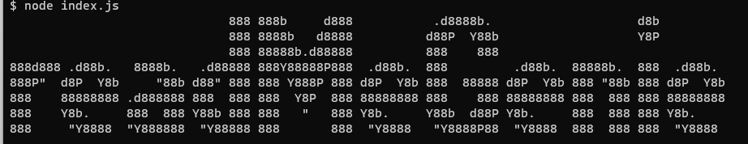

# readMeGenie 


## Table of Contents
- [Description](#description)
- [Installation](#installation)
- [Usage](#usage)
- [Features](#features)
- [Contributing](#contributing)
- [Contact](#contact)
- [License](#license)


## Description

Using readmeGenie, users are guided through a series of questions related to their project. This interactive approach ensures that all relevant information is collected and processed neatly in Markdown. readmeGenie provides README.md file templates for you to follow, depending on the tool or app the user is building. With review and summary features, and automated file generation in the user's working directory, readmeGenie can aid you in saving time and effort while simultaneously improving quality and consistency.

## Installation

### Welcome to readmeGenie Installation Guide!

1. **Clone the Repository:**
   - Run: git clone https://github.com/your-username/readmeGenie.git
   (Replace with the actual repository URL.)

2. **Navigate to the Project Directory:**
   - Run: cd readmeGenie

3. **Install Dependencies:**
   - Inside the project directory, run: npm install
   (This installs all required dependencies.)

4. **Run the Application:**
   - Start readmeGenie by running: node index.js
   (This launches the tool and prompts you for project details.)

5. **Follow the Prompts:**
   - Answer the series of questions to generate your README file.

6. **Review and Save Your README:**
   - After answering, review your inputs.
   - Confirm to generate and save the README.md in your current directory.

**Notes:**
- Ensure Node.js is installed on your system.
- Execute these steps in the directory where you want the README.md file.

Happy Documentation with readmeGenie!


## Usage

## Usage

To generate your README.md file using `readmeGenie`, follow these steps:

1. **Clone the Repository**:
   - Run the following command to clone the repository:
     ```
     git clone https://github.com/your-username/readmeGenie.git
     ```

2. **Navigate to the Project Directory**:
   - Change your working directory to the cloned `readmeGenie` directory:
     ```
     cd readmeGenie
     ```

3. **Install Dependencies**:
   - Install all required dependencies by running:
     ```
     npm install
     ```

4. **Run the Application**:
   - Start `readmeGenie` by running:
     ```
     node index.js
     ```
     This will launch the tool and prompt you for project details.

5. **Follow the Prompts**:
   - Answer the series of questions to generate your README file.

6. **Review and Save Your README**:
   - After answering, review your inputs.
   - Confirm to generate and save the `README.md` file in your current directory.

**Notes**:
- Ensure Node.js is installed on your system.
- Execute these steps in the directory where you want the `README.md` file.

Happy Documentation with `readmeGenie`!


## Features
List the features of your CLI tool.

## Contributing
 readMeGenie is open to any developper that wants to improve the tool and make it their own. Happy Coding ! 

## Contact
- GitHub: [https://github.com/Maximilian93B/]
- Email: [max.md.bosch@gmail.com](mailto:max.md.bosch@gmail.com)

## License
This project is licensed under the MIT license.
